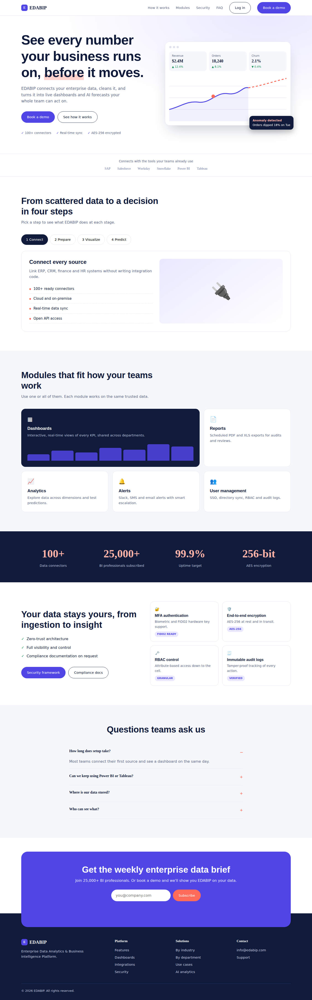

# EDABIP – Enterprise Data Analytics & Business Intelligence Platform

A responsive landing page for a business intelligence platform, built with plain HTML, CSS and JavaScript (no frameworks).



## Features
- Responsive layout for desktop, tablet and mobile
- Interactive "How it works" tabs
- Theme switcher that remembers your choice
- FAQ accordion
- Newsletter form with email validation

## How to run
1. Clone the repository:
```bash
   git clone https://github.com/swarna-dot102/YOUR-REPO-NAME.git
```
2. Open the folder in VS Code.
3. Right-click `index.html` and choose **Open with Live Server** (or double-click `index.html` to open it in a browser).

No installation or build step is needed.

## Project structure
```
index.html
css/style.css
js/script.js
docs/screenshot.png
```

## What was difficult
The hardest part was making the layout responsive. The card grids looked fine on desktop but broke on mobile until I learned to use media queries and CSS grid. I also found it difficult at first to set up Git and push my code to GitHub, because I had to sign in and connect the repository. Getting the theme switcher to remember the chosen theme took a few tries, but I solved it with localStorage.